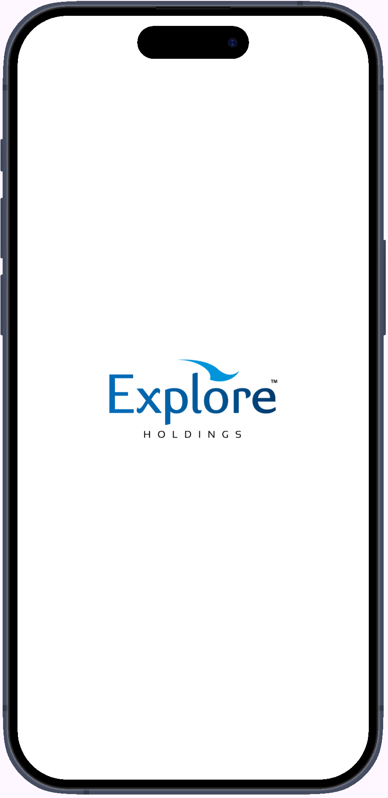
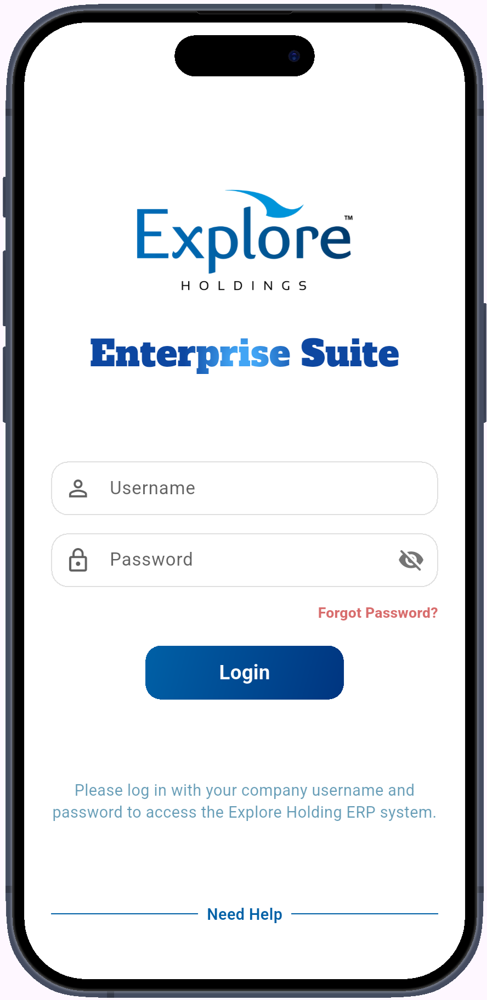
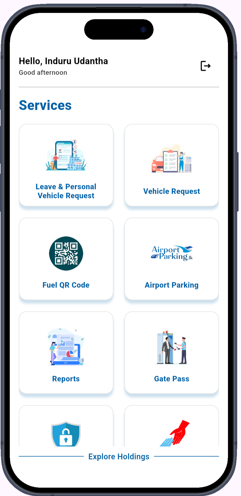
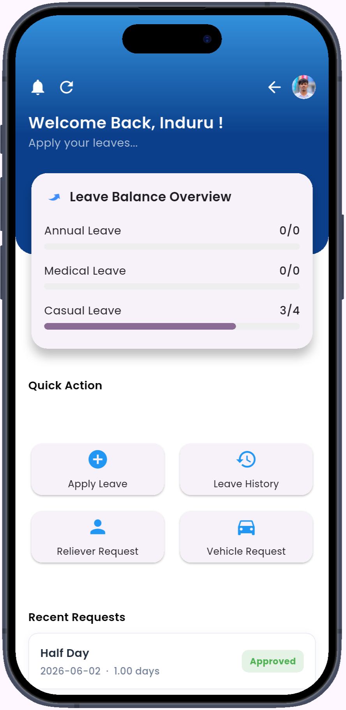
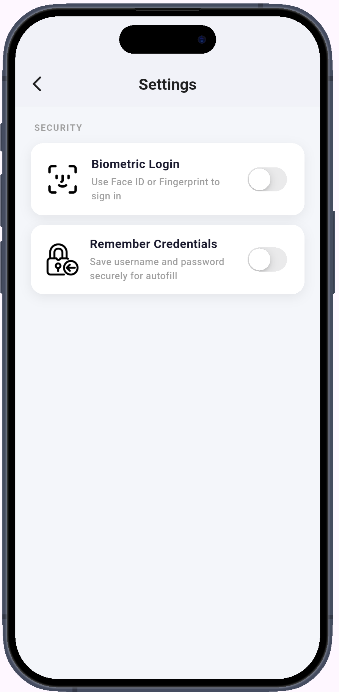

<p align="center">
  
</p>

<h1 align="center">Explore Enterprise Suite</h1>

<p align="center">
  <strong>A comprehensive enterprise mobile platform built with Flutter</strong><br/>
  Streamlining HR, Operations, Transport, and Facilities Management — all in one app.
</p>

<p align="center">
  
  
  
  
</p>

---

## 📖 Overview

**Explore Enterprise Suite** is an internal enterprise mobile application developed for Explore Vacations & Travels. It replaces fragmented paper-based and email-driven workflows with a unified, digital-first platform — enabling employees, managers, and operations teams to collaborate efficiently from their mobile devices.

The app delivers real-time visibility, role-based access control, and end-to-end workflow automation across critical business functions including HR leave management, fleet operations, gate pass management, IT support ticketing, meetings, and more.

---

📸 Screenshots

<p align="center">
  
  
  
  
  
</p>

---

## ✨ Features

### 🏖️ Leave Management
- Apply for leave and upload supporting documents
- Real-time leave balance dashboard (annual, medical, casual, etc.)
- Manager approval workflow with instant in-app notifications
- Reliever request system to assign stand-in coverage
- Full leave history with status tracking

### 🚗 Vehicle Management
- **Personal Use Requests** — request a company vehicle for personal trips with full approval flow
- **Office Use Requests** — raise vehicle requisitions for official business travel
- **Shuttle & Transfer Tracking** — view and manage assigned shuttle and transfer trips in real time
- Manager assignment of vehicles with driver and trip detail management

### 🅿️ Airport Parking Customer Handling
- Search and manage airport parking slot bookings by reference
- Check-in / Check-out with real-time status updates
- Generate and view PDF invoices directly in-app
- Role-restricted access for authorised parking staff

### 🚪 Staff Gate Pass
- Employees can submit gate pass requests with reason and timeframe
- Manager review queue with approve / reject actions
- Summary view for tracking all active and past gate passes

### 🔑 Fuel QR Code
- Scan or display QR codes linked to company vehicles for fuel authorisation
- Reduces manual paperwork at fuel stations

### 🖥️ IT Support Desk
- Employees can raise IT support tickets with category, priority, and description
- **Dual-role system:** regular employees see their ticket history; IT agents see a full inbox
- Real-time conversation thread between employee and IT agent
- Ticket lifecycle: Open → In Progress → Resolved / Cancelled

### 📅 Meeting & Events
- Create meetings and events with participants, location, and agenda
- Manage your own upcoming and past events
- Add or remove participants via a searchable bottom sheet

### 📊 Reports *(HR & Management Only)*
- View HR-level operational reports and SR booking dashboards
- Export and share report data
- Access restricted to authorised management-level employees

### ⚙️ Settings & Account
- Update profile preferences and account settings
- Enable or disable biometric (fingerprint / face) login
- Privacy notice acknowledgement flow on first login

### 🔮 Coming Soon
- **Project & Task Management** — assign and track team tasks
- **Finance & Accounting** — digital financial records and accounting workflows

---

## 🔐 Security & Authentication

- **Username / Password** login with secure server-side validation
- **Biometric Login** (fingerprint & face recognition) via `local_auth` — optional, opt-in
- **Secure Credential Storage** using `flutter_secure_storage` (encrypted on-device)
- **Remember Me** with encrypted credential caching
- **Forgot Password / OTP** reset flow
- **Privacy Notice Dialog** presented on first login
- **Screen Protector** enabled on sensitive screens (e.g. parking invoices) to prevent screenshots

---

## 📱 Tech Stack

| Layer | Technology |
|-------|-----------|
| Framework | Flutter (Dart SDK ^3.10.7) |
| State Management | `setState` / native Flutter patterns |
| Backend | REST API (PHP) — hosted at `exploresuite.lk` |
| Auth & Notifications | Firebase Authentication + Firebase Cloud Messaging (FCM) |
| Local Storage | `shared_preferences` + `flutter_secure_storage` |
| PDF | `pdf` + `printing` packages |
| File Handling | `image_picker`, `file_picker`, `camera` |
| Biometrics | `local_auth` |
| Networking | `http` |
| Notifications | `flutter_local_notifications` + FCM |
| QR Code | Custom QR screen |
| UI | Material Design + `google_fonts` |

---

## 🗂️ Project Structure

```
lib/
├── AirportParking/         # Airport parking module (screen, PDF viewer, stats)
├── Constants/              # App colors, config constants
├── ITSupport/              # IT helpdesk module (create, view, agent inbox, chat)
├── Leaves/                 # Leave management module (dashboard, form, history)
├── Meeting&Events/         # Meetings & events module (dashboard, create, participants)
├── Models/                 # Data models (Gate Pass, Vehicle, etc.)
├── QRCode/                 # Fuel QR code module
├── Reports/                # Reports and dashboards (HR-restricted)
├── Services/               # API service layer (one file per domain)
├── StaffGatePass/          # Gate pass module (request, summary, manager view)
├── Vehicle/                # Vehicle request module (personal, office, shuttle, trips)
├── VehicleUtilization/     # Vehicle utilisation dashboard
├── exceptions/             # Custom app exceptions
├── ui/
│   └── dialogs/            # Reusable dialog widgets
├── users/                  # User role screens
├── app_config.dart         # Environment config (local / live API URL)
├── firebase_options.dart   # Firebase project config
├── home_screen.dart        # Main navigation hub (module grid)
├── login_screen.dart       # Login with biometric support
├── splash_screen.dart      # Animated splash screen
└── main.dart               # Entry point
```

---

## 🚀 Getting Started

### Prerequisites

- [Flutter SDK](https://flutter.dev/docs/get-started/install) `^3.10.7`
- Dart SDK `^3.10.7`
- Android Studio or Xcode
- A Firebase project with FCM enabled
- Access to the backend API

### Setup

**1. Clone the repository**
```bash
git clone https://github.com/your-org/explore-enterprise-suite.git
cd explore-enterprise-suite
```

**2. Install dependencies**
```bash
flutter pub get
```

**3. Configure environment**

Open `lib/app_config.dart` and set the API base URL:

```dart
class AppConfig {
  // LOCAL development
  static const String baseUrl = "http://192.168.1.x/mobile-api";
}
```

**4. Firebase setup**

Place your `google-services.json` (Android) in `android/app/` and configure `firebase_options.dart` with your Firebase project credentials.

**5. Run the app**
```bash
flutter run
```

---

## 🔧 Build & Release

```bash
# Android APK
flutter build apk --release

# Android App Bundle (for Play Store)
flutter build appbundle --release

# iOS
flutter build ios --release
```

---

## 🔔 Push Notifications

Firebase Cloud Messaging (FCM) is integrated for real-time push notifications. The app handles:
- **Foreground messages** — displayed as in-app banners
- **Background messages** — handled by the OS notification system
- **Notification routing** — deep link to the relevant screen on tap

---

## 📦 Key Dependencies

| Package | Purpose |
|---------|---------|
| `firebase_core` + `firebase_messaging` | Firebase integration & push notifications |
| `flutter_local_notifications` | Local notification display |
| `local_auth` | Biometric authentication |
| `flutter_secure_storage` | Encrypted credential storage |
| `shared_preferences` | Lightweight local preferences |
| `http` | REST API communication |
| `pdf` + `printing` | PDF generation and printing |
| `image_picker` + `file_picker` | Document and image uploads |
| `webview_flutter` | In-app web content |
| `photo_view` | Image zoom and preview |
| `google_fonts` | Custom typography |
| `intl` | Internationalisation & date formatting |
| `screen_protector` | Prevent screenshots on sensitive screens |

---

## 🤝 Contributing

This is a private enterprise application. For feature requests, bug reports, or contributions, please contact the development team or raise an issue via your internal project management system.

---

## 📄 License

This project is proprietary software owned by Explore Vacations & Travels. All rights reserved. Unauthorised copying, distribution, or modification is strictly prohibited.

---

<p align="center">
  Built with ❤️ using Flutter · Powered by Firebase · Hosted on exploresuite.lk
</p>
